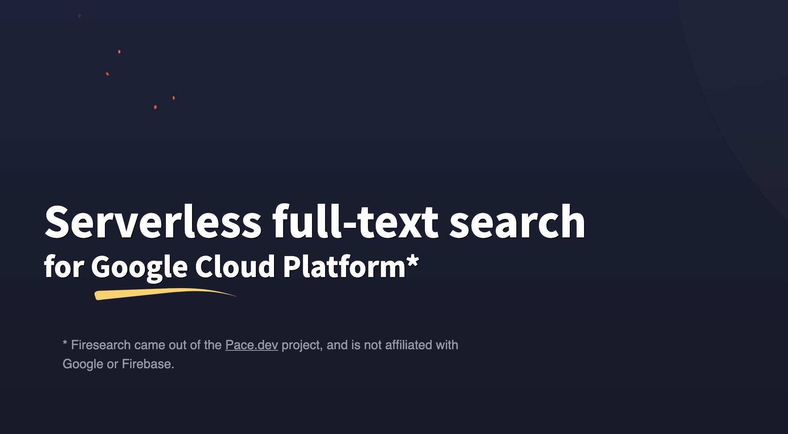

# Firesearch developer kits

Firesearch SDK, client libraries, and example code.

* The Firesearch API is approaching v1, until then these clients should be considered in beta

[](https://firesearch.dev/)

## Clients

Firesearch clients allow you to interact with your instances
via Firesearch's API.

### No dependency management

A simple way to integrate with Firesearch without dependency management
is to copy the client files directly into your own project.

* *Go* [Download](./clients/go/firesearch.gen.go) [Example](examples/go-example)
* *Swift* [Download](./clients/swift/Firesearch.gen.swift) 
* *TypeScript* [Download](./clients/ts/firesearch.gen.ts)
* *JavaScript* [Download](./clients/js/firesearch.gen.js) [Example](examples/javascript-example)

### Go

To use the official Go client:

```bash
go get github.com/pacedotdev/firesearch-sdk/clients/go/firesearch
```

* The Go client is maintained as a Go module
